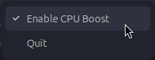

# BOOST TOGGLE INDICATOR

## A simple tray icon tool to toggle CPU boost on supported Linux systems

This tool uses the Linux cpu-freq driver to check and control the current CPU boost status, displaying it via a AppIndicator tray icon that shows whether boost is on or off.

| Boost State | Tray Icon |
|-------------|-----------|
| Boost Off   |  |
| Boost On    |    | 

You can toggle boost with a single click plus authentication — privilege elevation is handled via pkexec.



The current boost state is saved to disk and restored on the next boot. 

When the boost status is disabled, CPU frequency is limited to the base clock leading to lower temperatures and saving power. Depending on the CPU this can incur a significant performance hit.

CPU boost driver (cpu-freq) documentation: <https://www.kernel.org/doc/Documentation/cpu-freq/boost.txt>

## Dependencies/requirements:

Shell with AppIndicator support, libayatana-appindicator3, Python 3, and pkexec via policykit (for privilege elevation). Tested on Ubuntu with the Ubuntu AppIndicators extension enabled. Install all deps via the following command:

```bash
sudo apt install python3-gi python3-gi-cairo gir1.2-gtk-3.0 \
                 gir1.2-ayatanaappindicator3-0.1 libayatana-appindicator3-1 \
                 policykit-1
```                 

## How to use

You can run the Python script `boost_toggle_indicator` directly from the directory you extracted it to. 

At startup, the program will check for compatibility of the CPU and will add an icon to your tray reflecting the current boost status. Clicking on this tray icon opens up a menu where you can toggle `Enable CPU Boost` on or off. Your operating system will ask for authentication every time you toggle between the modes.

Boost Toggle Indicator will save the current state in the `.config/boost-toggle` directory and will always try to reload the most recent status at startup.

## Installation and autostart

If you want the program to run automatically at startup and restore your previous boost status, the following steps are required:

Copy `boost-toggle-indicator` to `/usr/local/bin` and make it executable:
	```bash
	sudo cp boost-toggle-indicator /usr/local/bin/
	sudo chmod +x /usr/local/bin/boost-toggle-indicator
	```

Copy `boost-toggle-indicator.desktop` to your `.config/autostart` directory
```bash
cp boost-toggle-indicator.desktop ~/.config/autostart/
```

#### Recommended step for using intended icons
			
The program uses icons to clearly display the boost status. It expects to find the icons folder either in the current directory (i.e., where you extracted the program), in `~/.local/share/boost-toggle` or in `/usr/share/boost-toggle`. If the icons are not found, the program will fallback to always use a generic CPU icon which may not reflect the current boost state. When using the program via autostart or via a launcher, installing the icons in one of the pre-defined locations is recommended.

For a single-user installation:
```bash
mkdir ~/.local/share/boost-toggle
cp -r icons ~/.local/share/boost-toggle/
```

or for a system-wide installation:
```bash
sudo mkdir /usr/share/boost-toggle
sudo cp -r icons /usr/share/boost-toggle/
```

#### Recommend step for using launchers
			
To make the utility searchable and executable for standard launchers
```bash	
sudo cp boost-toggle-indicator.desktop /usr/share/applications/
```

## Attributions

The CPU icons used in this project are derived from two icons provided in the Material Black Blueberry Suru icon theme, part of the Material Black COLORS Icon-Superpack by rtl88, available at <https://www.gnome-look.org/p/1316887/>. The author states these icons are based on work originally licensed under GPLv3. Accordingly, these icons are used here under the terms of the GNU General Public License v3.0.


## License

This project is licensed under the GNU General Public License v3.0 (GPLv3). See the LICENSE file for details.
